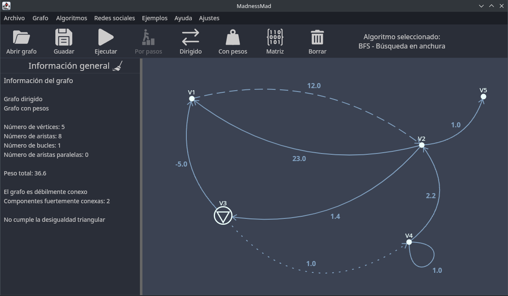
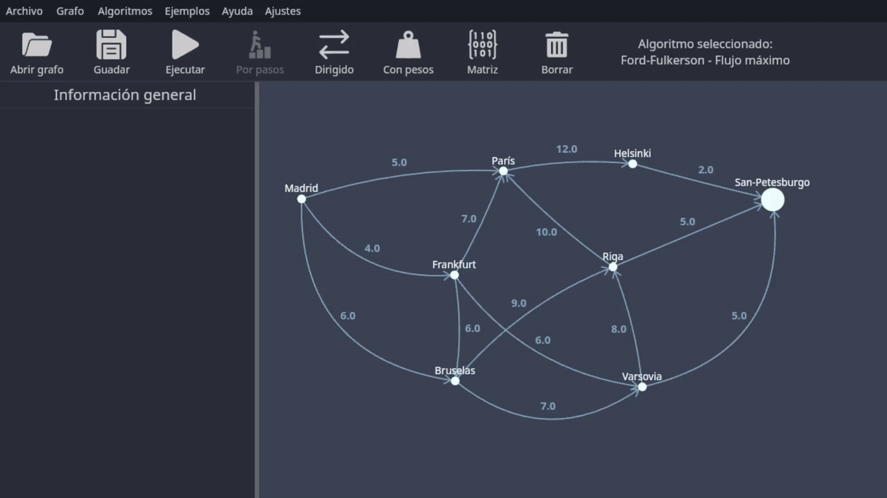
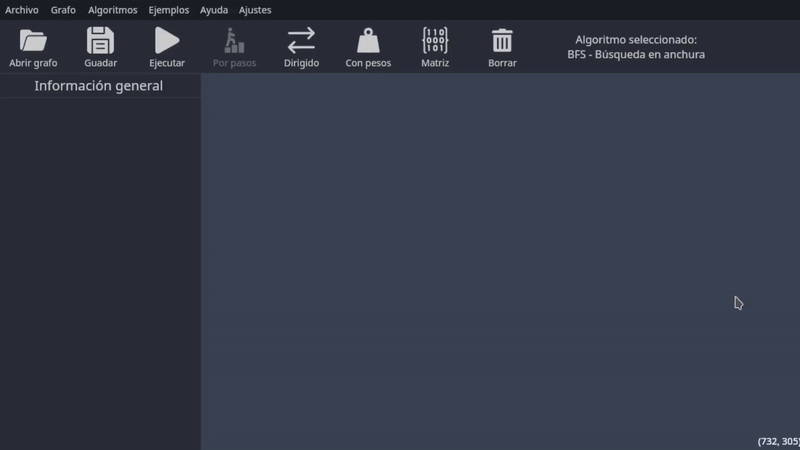

# 🕸️ MadnessMad

### Documentación externa

---

- [1 Introducción](#1-introducción)
- [2 Interfaz](#2-interfaz)
  - [2.1 Vértices](#21-vértices)
  - [2.2 Aristas](#22-aristas)
  - [2.3 TopBar]()
  - [2.4 ToolBar]()
- [3 Controles del grafo](#3-controles-del-grafo)
  - [3.1 Ratón](#31-ratón)
  - [3.2 Teclado](#32-teclado)
- [4 Algoritmos](#4-algoritmos)
  - [4.1 Implementados](#41-implementados)
  - [4.2 Animaciones](#42-animaciones)
- [5 Algoritmos de redes sociales](#5-algoritmos-de-redes-sociales)
- [6 Opciones de información del grafo](#6-opciones-de-información-del-grafo)
- [7 Matrices del grafo](#7-matrices-del-grafo)
- [8 Archivo (Importaciones y exportaciones)](#8-archivo-importaciones-y-exportaciones)

---

## 1 Introducción

MadnessMad es un editor de grafos desarrollado con kotlin y Jetpack Compose.
Este proyecto tiene como objetivo proporcionar una herramienta intuitiva y potente para la creación, visualización
y manipulación de grafos, así como la ejecución de algoritmos clásicos sobre ellos.

Es un proyecto que apuesta por la modularidad y la escalabilidad, permitiendo futuras expansiones y mejoras en su funcionalidad.
Así como una interfaz sencilla y minimalista que ofrece un control total a la hora de manipular el grafo.

Cuenta con una gran variedad de atajos de teclado que permiten una gran velocidad a la hora de editar el grafo.

## 2 Interfaz

MadnessMad apuesta por una interfaz minimalista a la par que práctica e intuitiva.

### 2.1 Vértices

Características de los vértices:
* Se crean con la tecla `V`
* Se les puede cambiar el nombre con la tecla `R` o abriendo el menu contextual con click derecho.
* Se les puede cambiar el color con la tecla `C` o abriendo el menu contextual con click derecho.
* Se les puede cambiar el estilo con la tecla `F`.
* Su tamaño puede ser modificado con `Crtl +` y `Ctrl -`.

### 2.2 Aristas

Características de las aristas:
- Las aristas se crean arrastrando desde un vértice hasta otro con el `click izquierdo`.
- Peso, nombre, color, curvatura, dirección y estilos son modificables por el usuario. Ver en [3 Controles del grafo](#3-controles-del-grafo).
- Con la tecla `E` el usuario puede alternar el texto de las aristas entre peso, nombre, ambos, nada.

## 3 Controles del grafo

El usuario puede modificar los atajos de tecla a su gusto desde la opción `ajustes`. (// TODO)

### 3.1 Ratón

* Interacciones en el vacío
    * Sin nada seleccionado
        - **CD + arrastrar:** mover el lienzo
        - **RR + Ctrl:** hacer zoom
        - **CI + Shift:** seleccionar zona rectángular

    * Con un elemento seleccionado
        - **CD:** abrir menú contextual del elemento
        - **CI:** deseleccionar

    * Con varios elementos seleccionados
        - **CI:** deseleccionar todos
        - **CD:** abrir menú múltiple
            - Todos **aristas** → menú múltiple de aristas
            - Todos **vértices** → menú múltiple de vértices
            - Mixto → menú combinado con opciones comunes

* Interacciones con elementos
    * Elementos (general)
        - **CI:** seleccionar elemento
        - **CI + Mayús:** selección múltiple
        - **CD:** abrir menú contextual del elemento
        - **CI + Mayús + arrastrar:** selección rectangular
            - Incluye bucles de vértices seleccionados
            - Incluye aristas si ambos vértices se seleccionan a la vez

* Vértices
    - **CI + arrastrar:** crear arista hasta otro vértice
    - **CI + Ctrl + arrastrar:** mover vértice
    - **Ctrl + + / -:** cambiar tamaño de los vértices seleccionados

* Aristas
    - **CI + Ctrl + arrastrar (sobre el peso o punto medio):** curvar arista

* Bucles
    - **CI + Ctrl + arrastrar:** ajustar tamaño
    - **CI + Mayús + arrastrar:** rotar bucle

* Leyenda
    - **CD:** Click Derecho
    - **CI:** Click Izquierdo
    - **RR:** Rueda del ratón

### 3.2 Teclado

| Tecla        | Acción                           |
|:-------------|:---------------------------------|
| **V**        | Agregar vértice                  |
| **D**        | Eliminar elemento                |
| **S**        | Alternar estilo de arista        |
| **B**        | Añadir bucle                     |
| **R**        | Renombrar elemento               |
| **W**        | Cambiar peso de arista(s)        |
| **C**        | Cambiar color                    |
| **A**        | Cambiar dirección arista         |
| **E**        | Nombre A, Peso A, Ambas, Ninguna |
| **M**        | Abrir el menu de matrices        |
| **F**        | Alternar estilo de vértice       |
| **Ctrl + Z** | Deshacer última acción           |
| **Ctrl + Y** | Rehacer última acción            |

// TODO: Ctrl + C, Ctrl + V, Ctrl + D, Ctrl + X, Alt 1, Alt 2 (Alt x para opciones de la toolbar) serán agregados en el futuro

## 4 Algoritmos

Los algoritmos se seleccionan desde el menu en la parte superior llamado `algoritmos` y aparece el algoritmo seleccionado
en la parte superior derecha.

Para ejecutarlos se usa el icono de `ejecutar` o en su defecto si el algoritmo lo permite, `por pasos`.

### 4.1 Implementados

| Algoritmo                               | Descripción breve                                                                 |
|:----------------------------------------|:----------------------------------------------------------------------------------|
| **BFS**                                 | Recorre el grafo por niveles desde un vértice origen (búsqueda en anchura).       |
| **DFS**                                 | Recorre el grafo profundizando lo máximo posible antes de retroceder.             |
| **Dijkstra**                            | Calcula el camino más corto desde un origen sin permitir pesos negativos.         |
| **Bellman–Ford**                        | Calcula caminos mínimos permitiendo pesos negativos y detecta ciclos negativos.  |
| **Kruskal**                             | Construye un árbol de expansión mínima en grafos no dirigidos.                    |
| **Edmonds 2**                           | Calcula emparejamientos máximos en grafos generales.                              |
| **Hierholzer**                          | Obtiene un ciclo o camino euleriano recorriendo todas las aristas una vez.        |
| **Cartero Chino**                       | Encuentra el recorrido cerrado de coste mínimo que pasa por todas las aristas.    |
| **Ford–Fulkerson**                     | Calcula el flujo máximo entre un origen y un destino en una red.                  |
| **Ciclo hamiltoniano de bajo peso**     | Busca un ciclo hamiltoniano válido priorizando pesos bajos (heurístico).          |
| **Ciclo hamiltoniano de mínimo peso**   | Calcula el ciclo hamiltoniano de coste mínimo por fuerza bruta.                   |
| **Hopcroft–Tarjan**                     | Detecta vértices de corte y aristas de corte en grafos no dirigidos.              |

### 4.2 Animaciones

Algunos algoritmos permiten animaciones, esto facilita la comprensión de los mismos.

El siguiente vídeo muestra la animación del algoritmo de Ford-Fulkerson:

## 5 Algoritmos de redes sociales

| Métrica                               | Descripción breve                                                                 |
|:--------------------------------------|:----------------------------------------------------------------------------------|
| **Centralidad de grado**              | Mide el número de conexiones directas de un vértice.                              |
| **Centralidad de intermediación**     | Cuantifica cuántos caminos mínimos pasan por un vértice.                          |
| **Centralidad de cercanía**           | Mide lo cerca que está un vértice del resto según distancias mínimas.             |
| **Centralidad de excentricidad**      | Se basa en la mayor distancia mínima desde un vértice a cualquier otro.           |
| **Clustering global**                 | Evalúa el grado de agrupamiento global del grafo completo.                        |
| **Clustering local**                  | Mide cómo de conectados están entre sí los vecinos de un vértice.                |
| **Clustering medio**                  | Media del clustering local de todos los vértices del grafo.                      |
| **Alcance medio**                     | Distancia media entre pares de vértices alcanzables del grafo.                    |
| **Diámetro**                          | Máxima distancia mínima entre cualquier par de vértices del grafo.                |
| **PageRank**                          | Asigna importancia a los vértices según enlaces entrantes y su relevancia.        |

## 6 Opciones de información del grafo

Desde el menú superior `Grafo` el usuario tiene las siguientes opciones:

- `Información del grafo`: muestra información general del grafo como:
  - Número de elementos (vértices, aristas, bucles, aristas paralelas).
  - Peso total.
  - Conectividad del grafo.
  - Desigualdad triangular.
- `Grados de los vértices`: si el grafo es dirigidos muestra de entrada y de salida.
- `Grafo subyacente`: convierte el grafo a no dirigido.
- `Convertir a dirigido (bidireccional)`: convierte un grafo no dirigido a uno dirigido duplicando las aristas en dirección contraria.
- `Generar grafo completo`: genera un grafo completo de hasta 25 vértices.

## 7 Matrices del grafo

Desde la opción `Matriz` puedes visualizar las siguientes matrices del grafo actual:
- De adyacencia.
- De pesos.
- De incidencia.
- De acceso.

## 8 Archivo (Importaciones y exportaciones)

Importaciones:
- A mano desde el programa usando matrices.
- Usando matrices (adyacencia, de pesos y de incidencia .csv)
- Formato nativo de MadnessMad (.json)
- Formato nativo de SWGraphs (.xml)

Si el programa detecta un error a la hora de importar un grafo, la aplicación se lo comunicará al usuario mediante
un código de erro que facilitará encontrar el error de la importación.

Exportaciones:
- Usando matrices (adyacencia, de pesos y de incidencia .csv)
- Formato nativo de MadnessMad (.json)
- Formato nativo de SWGraphs (.xml)

Vídeo ejemplo de la importación de matrices a mano:

