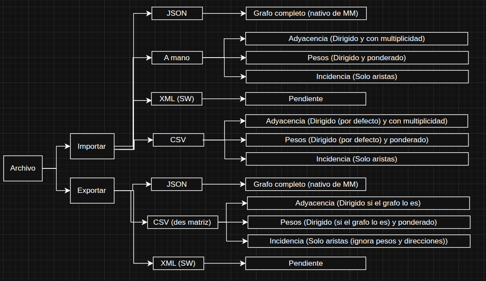

# 🕸️ MadnessMad

MadnessMad es un editor de grafos desarrollado con kotlin y Jetpack Compose.
Este proyecto tiene como objetivo proporcionar una herramienta intuitiva y potente para la creación, visualización y manipulación de grafos, así como la ejecución de algoritmos clásicos sobre ellos.

Es un proyecto que apuesta por la modularidad y la escalabilidad, permitiendo futuras expansiones y mejoras en su funcionalidad.
Así como una interfaz sencilla y minimalista que ofrece un control total a la hora de manipular el grafo.

Cuenta con una gran variedad de atajos de teclado que permiten una gran velocidad a la hora de editar el grafo.
Además de un modo legacy para aquellos usuarios que venga de editores más antiguos como SWGraphs (TODO: todavía no implementado).


### 📑 Índice funcional

- [🎥 Vídeo de la interfaz](#-vídeo-de-la-interfaz)
- [🎮 Controles y funcionalidades](#-controles-del-editor-de-grafos)
- [🧠 Algorítmos](#-algorítmos)
- [🧮 Matrices del grafo](#-matrices-del-grafo)
- [📂 Importaciones y Exportaciones](#-importaciones-y-exportaciones)

### 🛠️ Índice técnico
- [🧱 Arquitectura del Estado del Grafo](#-arquitectura-del-estado-del-grafo)
- [🔵 VertexModel](#-VertexModel)
- [➡️ EdgeModel](#-EdgeModel)

## 🎥 Vídeo de la interfaz


En este vídeo se puede observar la interfaz principal del editor de grafos, mostrando algunas de sus funcionalidades básicas
como la creación de vértices y aristas, así como la interacción con los elementos del grafo.


## 🎮 Controles del editor de grafos

### 🖱 Interacciones en el vacío

#### ⬜ Sin nada seleccionado
- **CD + arrastrar:** mover el lienzo
- **RR + Ctrl:** hacer zoom
- **CI + Shift:** seleccionar zona rectángular

#### 🔍 Con un elemento seleccionado
- **CD:** abrir menú contextual del elemento
- **CI:** deseleccionar

#### 📦 Con varios elementos seleccionados
- **CI:** deseleccionar todos
- **CD:** abrir menú múltiple
  - Todos **aristas** → menú múltiple de aristas
  - Todos **vértices** → menú múltiple de vértices
  - Mixto → menú combinado con opciones comunes

---

### 🔹 Interacciones con elementos

#### 🧩 Elementos (general)
- **CI:** seleccionar elemento
- **CI + Mayús:** selección múltiple
- **CD:** abrir menú contextual del elemento
- **CI + Mayús + arrastrar:** selección rectangular
  - Incluye bucles de vértices seleccionados
  - Incluye aristas si ambos vértices se seleccionan a la vez

---

#### 🔵 Vértices
- **CI + arrastrar:** crear arista hasta otro vértice
- **CI + Ctrl + arrastrar:** mover vértice
- **Ctrl + + / -:** cambiar tamaño de los vértices seleccionados

---

#### ➡️ Aristas
- **CI + Ctrl + arrastrar (sobre el peso o punto medio):** curvar arista

---

#### 🔁 Bucles
- **CI + Ctrl + arrastrar:** ajustar tamaño
- **CI + Mayús + arrastrar:** rotar bucle

---

#### 📘 Leyenda
- **CD:** Click Derecho
- **CI:** Click Izquierdo
- **RR:** Rueda del ratón

---

### ⌨️ Atajos de teclado

Los atajos de teclado se almacenarán en una base de datos interna y el usuario
podrá modificarlos a su gusto (en un futuro) desde la interfaz del programa.

| Tecla        | Acción                           |
|:-------------|:---------------------------------|
| **V**        | Agregar vértice                  |
| **D**        | Eliminar elemento                |
| **S**        | Alternar estilo de arista        |
| **B**        | Añadir bucle                     |
| **R**        | Renombrar elemento               |
| **W**        | Cambiar peso de arista(s)        |
| **C**        | Cambiar color                    |
| **A**        | Cambiar dirección arista         |
| **E**        | Nombre A, Peso A, Ambas, Ninguna |
| **M**        | Abrir el menu de matrices        |
| **F**        | Alternar estilo de vértice       |
| **Ctrl + Z** | Deshacer última acción           |
| **Ctrl + Y** | Rehacer última acción            |

---

## ⚙️ Algorítmos

#### Algoritmos implementados:

* BFS
* DFS
* Dijkstra
* Kruskal
* Hierholzer

#### ⚫ Algoritmos por implementar (si o si):
* Edmonds 2
* Cartero chino
* Ford-Fulkerson
* Ciclo hamiltoniano de 'bajo' peso
* Ciclo hamiltoniano de mínimo peso
* Hopcroft-Tarjan

#### ⚫ Posibles implementaciones futuras (no prioritarias):
* Prim
* Bellman–Ford
* Floyd–Warshall
* Kosaraju
* Tarjan (SCC)
* Tarjan (puentes y articulaciones)
* A*
* Johnson
* Dinic
* Hungarian
* Bron–Kerbosch
* Stoer–Wagner
* Emparejamiento máximo (Hopcroft–Karp)

#### ⚫ Acciones que eliminan el color de la animación:
* Borrar vértice/s
* Borrar arista/s
* Cambiar dirección de arista/s
* Añadir aristas
* Añadir vértices
* Alternar entre grafo dirigido y no dirigido
* Alternar entre grafo ponderado y no ponderado (Dijkstra, kruskal)
* Cambiar peso de arista/s (Dijkstra, kruskal)

La idea de esto es que si en cualquier momento se modifica el grafo con algo que altera
su estructura significativamente para el cálculo del algoritmo, el algoritmo se quite para evitar confusiones.

#### ⚫ Ejemplo de algoritmo en el programa: BFS


---

## 🧮 Matrices del grafo

El programa da la opción de visualizar las matrices de adyacencia, incidencia y de pesos del grafo.
Ejemplo de la matriz de incidencia de [este grafo](./assets/ejemplo_grafo_json.json)


---

## 📂 Importaciones y Exportaciones

Antes de entrar en profundidad con importaciones y exportaciones veamos un esquema acerca de este punto:



### Importaciones

#### Grafo completo (.json)

El sistema principal de importación y nativo de MadnessMad por su eficiencia para almacenar gran cantidad de importación
y su compatibilidad con la librería `"org.jetbrains.kotlinx:kotlinx-serialization-json:1.7.1"`.

Por ejemplo para el siguiente grafo:


El archivo JSON correspondiente lo puedes ver [aquí](./assets/ejemplo_grafo_json.json).

#### Grafo a partir de un archivo .csv

* [Matriz de adyacencia](./assets/archivo/matriz_adyacencia.csv)
* [Matriz de pesos](./assets/archivo/matriz_pesos.csv)
* [Matriz de incidencia](./assets/archivo/matriz_incidencia.csv)

Para la matriz de adyacencia y de pesos los últimos dos parámetros sueltos pueden ser 1 o 0 y pueden estar en el csv o no,
si no están por defecto ambos son 1. Indican, el primero si es o no ponderado y el segundo si es o no dirigido el grafo.


#### A mano desde la interfaz
El propio programa permite importar estas 3 matrices a partir de la propia interfaz de forma manual:


* Si la matriz es de adyacencia:
    - Por defecto será dirigido y ponderado (1.0 para todas las aristas)
    - Admite multiplicidad
    - Admite bucles
* Si la matriz es de pesos:
    - Por defecto será dirigido y ponderado
    - No admite multiplicidad
    - Admite bucles
* Si la matriz es de incidencia:
    - Por defecto es no dirigido y ponderado (1.0 para todas las aristas)
    - Admite bucles, con un 2
    - No permite que la suma de las columnas sea distinto de 2 aunque si permite que sea 0 y esa arista no se dibuja

#### Por un grafo de SwGraphs (.xml)

Pendiente de ser implementado

### Exportaciones

#### Grafo completo (.json)

Igual que en el apartado de importaciones

#### Grafo a partir de un archivo (.csv)

Esta exportación se realizará desde el icono de "Matriz" desde la toolbar, permitiendo exportar los 3 tipos de matrices ya mencionados.

Como la matriz de pesos no admite multiplicidad, si hay varias aristas paralelas entre dos vértices se añadirá en esa
relación la suma de los pesos de las aristas paralelas que lleven la misma dirección si el grafo es dirigido.

#### Por un grafo de SwGraphs (.xml)

Pendiente de ser implementado

### Guía de errores a la hora de importar un grafo

* En el futuro, en la doc de la página web se dejarán ejemplo detallados de como solucionar errores,
* para ello en el díalogo de erro se añadirá un link al error en cuestión en la web

#### Archivo .json

Aquí se pueden dar 3 tipos de errores:
* [InvalidJsonStructure](./assets/jsonError/InvalidJsonStructure.json): simplemente la estructura del json no es correcta
* [InvalidVertex](./assets/jsonError/InvalidVertex.json): la estructura es correcta, pero hay algo incorrecto en algún vértice del json (normalmente en el style)
* [InvalidEdge](./assets/jsonError/InvalidEdge.json): la estructura es correcta, pero hay algo incorrecto en alguna arista del json (normalmente en el style)

#### Archivo .csv

Aquí pueden haber 2 tipos de errores:
* [InvalidCSVFormat](./assets/csvErrors/InvalidCSVFormat.csv): el formato del CSV es incorrecto
* [InvalidCSVIncidenceColumn](./assets/csvErrors/InvalidCSVIncidenceColumn.csv): cuando una columna suma un número disintos de 0 y de 2

---

# 🧬 Apartado técnico

## 🧠 Arquitectura del estado del grafo

### GraphState
* Contenedor raíz que agrupa todos los subestados del editor.

#### GraphModelState
* Define la estructura lógica del grafo (vértices, aristas y propiedades globales).

#### GraphInteractionState
* Gestiona cómo el usuario interactúa con el grafo (selecciones, arrastres, creación temporal).

#### GraphUIState
* Controla todo lo visual y los diálogos de la interfaz.

#### GraphHistoryState
* Administra el historial de acciones para deshacer y rehacer.

#### GraphAlgorithmState
* Mantiene el estado, datos y animaciones de los algoritmos ejecutados.

#### GraphViewportState
* Controla la transformación del lienzo (zoom y desplazamiento).

---

## 🔵 VertexModel

```kotlin
data class VertexModel(
    val id: String = Uuid.random().toString(),
    var name: MutableState<String> = mutableStateOf("V${Globals.vCount++}"),
    var position: Pair<Float, Float> = 0f to 0f,
    var color: MutableState<Color> = mutableStateOf(Colors.VERTEX_DEFAULT),
    var size: MutableState<Float> = mutableStateOf(1f),
    var style: MutableState<VertexStyle> = mutableStateOf(VertexStyle.CIRCLE)
)
```

---

## ➡️ EdgeModel

```kotlin
data class EdgeModel(
  val id: String = Uuid.random().toString(),
  var name: MutableState<String> = mutableStateOf("E${Globals.eCount++}"),
  var vertex: MutableState<Pair<String, String>> = mutableStateOf("" to ""),
  var weight: MutableState<Float> = mutableStateOf(1.0f),
  var style: MutableState<EdgeStyle> = mutableStateOf(EdgeStyle.DEFAULT),
  var curvature: MutableState<Float> = mutableStateOf(0f),
  var loopAngle: MutableState<Float> = mutableStateOf(-45f),
  var loopFactor: MutableState<Float> = mutableStateOf(3f),
  var color: MutableState<Color> = mutableStateOf(Colors.EDGE_DEFAULT)
){
  fun isLoop() = vertex.value.first == vertex.value.second

  fun changeDirection(){
    vertex.value = vertex.value.second to vertex.value.first
    curvature.value *= -1f
  }
}
```

La curvatura de la arista se obtiene aplicando una curva de Bézier, como se muestra en la siguiente imagen:


---

